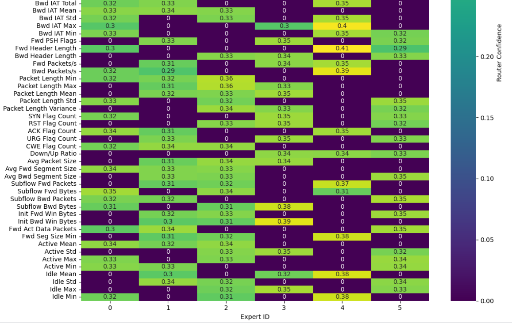

# TabRouter: Routing-Based MoE Transformer for Tabular Data

> **⚠️ Project Status:** This repository contains the experimental code and preliminary results for an **ongoing research project**. The architecture and findings are currently being prepared for submission to an IEEE Transaction journal.

## About
**TabRouter** is a routing-based Mixture-of-Experts (MoE) Transformer designed for high-dimensional tabular data. It combines **sparse expert routing** with **SwiGLU Transformer blocks** to achieve a dual objective:

1.  **State-of-the-Art Performance:** It outperforms classical baselines (such as XGBoost/CatBoost) and standard neural models (FT-Transformer) on complex classification tasks.
2.  **Transparency:** Unlike "black box" ensembles, TabRouter provides interpretable routing signals, allowing us to trace exactly how the model makes decisions.

## Preliminary Results

We are currently benchmarking TabRouter against the industry gold standard (**CatBoost**) and the leading deep learning baseline (**FT-Transformer**).

**Current Achievement:** Our model outperforms both baselines on the **minority/hard class (Class 2)** while matching the overall accuracy of GBDTs.

| Model Architecture | Accuracy | Weighted F1 | Macro F1 | Class 2 (Hard) F1 |
| :--- | :---: | :---: | :---: | :---: |
| **TabRouter (Ours)** | **0.95** | **0.96** | **0.89** | **0.71** 🥇 |
| CatBoost (GBDT) | 0.95 | 0.95 | 0.89 | 0.70 |
| FT-Transformer | 0.94 | 0.95 | 0.88 | 0.69 |

## Interpretability & Routing Analysis

One of the core contributions of this architecture is the ability to visualize **Token-to-Expert Routing**. The heatmap below illustrates how the gating network routes different features (rows) to specialized expert networks (columns).

*Figure: Visualization of interpretable sparse routing, where the gating network automatically learns to direct semantically distinct inputs to specialized experts—such as routing time-based features (e.g., Flow IAT, Idle Mean) primarily to Expert 4 and length-based statistics to Expert 3*

### Ongoing Work
We are actively refining the model and analyzing expert specialization entropy. Detailed architectural diagrams and formal proofs will be released upon publication.

## Contact
This project is currently under active development. For inquiries regarding the architecture, collaboration, or reproduction of these results, please contact:

**Email:** [vansh.22210136@viit.ac.in]
